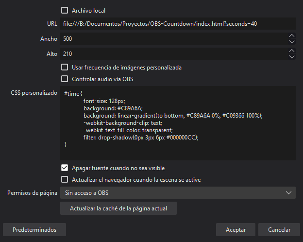

# OBS Countdown
Cuenta atrás para OBS Studio


## Instrucciones

1. Añadir navegador a la escena
2. Abrir preferencias del navegador añadido
3. Definir URL para abrir el index.html del contador
4. Añadir parámetro "seconds" a la url para definir duración de la cuenta atrás
5. Aplicar css al texto del contador
6. Sustituir ttf para modificar la fuente usada


## Configuración de ejemplo:


```
file:///B:/Documentos/Proyectos/OBS-Countdown/index.html?seconds=40
```

```
#time {
	font-size: 128px;
	background: #C89A6A;
	background: linear-gradient(to bottom, #C89A6A 0%, #C09366 100%);
	-webkit-background-clip: text;
	-webkit-text-fill-color: transparent;
	filter: drop-shadow(0px 3px 6px #000000CC);
}
```